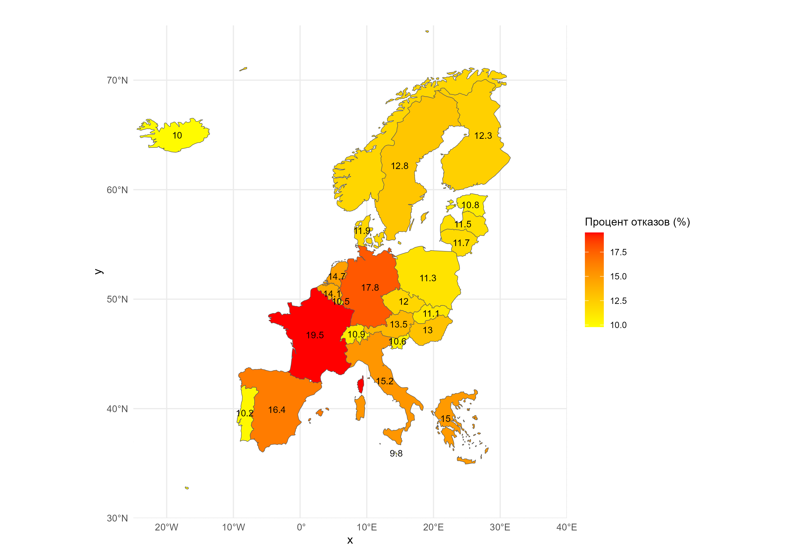

# Schengen visa refusal for Kazakhstan citizens in 2023

I have made a Schengen visa waiver card for citizens of Kazakhstan for 2023.

I developed this visualization using the R programming language using the libraries: tidyverse, r natural earth, rnaturalearthdata, cowplot. 

Top 5 countries with the highest bounce rate:

France 🇫🇷 - 19.5%
Germany 🇩🇪 - 17.8%
Spain 🇪🇸 - 16.4%
Italy 🇮🇹 - 15.2%
Greece 🇬🇷 - 15.0%

Top 5 countries with the lowest bounce rate:

Malta 🇲🇹 - 9.8%
Iceland 🇮🇸 - 10.0%
Luxembourg 🇱🇺 - 10.5%
Slovenia 🇸🇮 - 10.6%
Estonia 🇪🇪 - 10.8%

This map shows which countries of the Schengen area may be more or less loyal when considering visa applications. 

Countries with a low rejection rate may be preferable for citizens of Kazakhstan planning trips to Europe. 

However, it is important to remember that the success of applying for a visa depends on meeting all the requirements and preparing the documents correctly.
